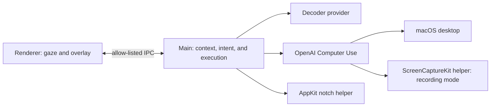
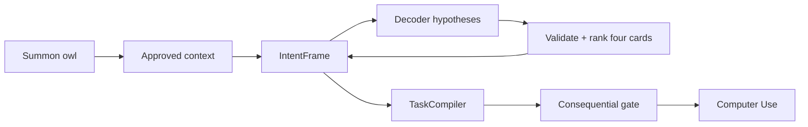

# Hoot architecture

Hoot is an Electron application with a privileged main process, a browser
renderer, and two small macOS helpers. The renderer owns gaze input and visible
overlay behavior. The main process owns context, intent composition, provider
requests, speech, state transitions, and desktop execution. The helpers own
notch pixels and filtered recording captures.

Hoot has no iPhone Mirroring integration. Active-window discovery and capture
use generic macOS APIs, so a narrow window receives the same geometry-based
layout as any other application.

## Process boundaries



The preload bridge exposes the allow-listed commands in `src/shared/ipc.ts` and
typed `ViewMessage` events. The bridge does not expose Node.js or arbitrary IPC
to the renderer.

## Runtime flow

1. `src/main/index.ts` starts the notch helper when its compiled executable is
   available, discovers the filtered capture helper, creates
   `InteractionController`, starts context polling, and registers IPC handlers.
2. `src/renderer/app/App.tsx` loads the configured gaze provider, smooths gaze
   samples, maps dwell commits to bridge calls, and forwards owl progress to the
   main process.
3. `InteractionController` enables context after summon, drives
   `StateMachine` and `IntentCompositionEngine`, speaks feedback, and starts
   `OpenAIComputerUseExecutor` for a terminal task.
4. The main process broadcasts `ViewMessage` values. An
   `interaction-snapshot` carries the authoritative prompt, context, task,
   state, and revision boundary. `applyMessage` treats null values as clears.

The interaction path is:



## Context service

`ContextEngine` is the context service and permission boundary. A summoned
session receives a session ID and an approved foreground app. An empty
`CONTEXT_ALLOWED_APPS` value starts in app scope; `ALLOW SESSION` promotes the
session to follow approved foreground app changes. A configured allowlist
pre-approves matching app names or bundle IDs.

The engine emits a `ContextSnapshot` when the access state, active window,
window capture, or bounded gaze anchor changes. The snapshot contains source
status and re-checkable window/document references. `MacAccessibilitySource`
performs one bounded focused-element query after an approved window change. It
exposes a focused control and title/value when the application provides them.
Browser DOM extraction is outside this boundary.

`ContextEngine.snapshotContext(true)` requests a screenshot only from the
approved active window. `ScreenCapturer.captureActiveWindow` returns an
unavailable source when that window cannot be captured; it does not crop the
primary display as a fallback. The executor has a separate full-display path
because desktop execution requires fresh desktop state.

`IntentCompositionEngine` forwards only an `active` snapshot and bounded
context ledger to decoder input. Paused, blocked, and disabled snapshots carry
no app content. Direct Gemini can receive an approved image. The configured
DeepSeek V4 Flash OpenRouter model receives structured fields without an image
when it is text-only. Context text remains untrusted evidence and cannot
authorize an action.

## Intent and provider boundaries

`IntentFrame` in `src/shared/intent.ts` stores typed fields, accepted evidence,
unresolved slots, and provenance. `ContextLedger` stores bounded weak
observations. `TargetResolver` performs open-world lookup. `CandidateRanker`
turns a decoder hypothesis pool into four diverse cards. `TaskCompiler` emits a
terminal task only from authoritative typed fields.

`DecoderRequestCoordinator` owns one committed or speculative request, an abort
signal, and an absolute deadline. OpenRouter streams JSON over SSE and buffers a
complete response before validation. Invalid, cancelled, timed-out, provider,
and semantic failures enter explicit recovery. The direct Gemini API handles a
typed OpenRouter transport failure only when
`DECODER_FALLBACK_PROVIDER=gemini` is set.

`DecoderProvider` defines the shared adapter contract. `OpenRouterDeepSeekProvider`
implements the OpenRouter path, `GeminiFlashLiteProvider` implements direct
Gemini, `DirectGeminiFallbackProvider` owns the explicit transport fallback, and
`FixtureDecoderProvider` supplies deterministic local tests.

`ExecutorProvider` defines the desktop executor contract. The OpenAI executor
uses the HTTP Responses API, captures a fresh screenshot for each action batch,
and applies a consequential-action confirmation boundary. A missing executor
key enters recovery; it never simulates desktop actions.

## Native helpers and recording

`native/NotchHost.swift` creates a nonactivating, click-through `NSPanel` at the
status-bar level. The helper uses AppKit safe-area geometry to align the black
surface with the physical camera gap and renders the owl sprite, progress ring,
and status glow. The renderer keeps a zero-opacity DOM proxy for the same gaze
hit region and uses its CSS surface when the helper is unavailable.

`native/ScreenCaptureHost.swift` runs only for a recording-mode screenshot. The
executor passes the Hoots process IDs, and ScreenCaptureKit excludes the
Electron and native-helper processes before encoding a PNG for Astra. A missing
helper, unresolved exclusion list, or missing Screen Recording permission is an
explicit capture error; the executor never uses an unfiltered fallback.

## Navigation and safety

`NavigationController` implements reading and vertical-feed modes with edge
dwell, fixed scroll steps, and cooldown. The main process validates that the
saved gaze anchor remains inside the approved active window before issuing a
scroll through the optional nut.js dependency. Navigation is disabled while
semantic, confirmation, execution, or recovery cards are active.

Terminal semantic selections enter execution directly. The executor pauses
before sending, posting, deleting, purchasing, paying, booking, or changing an
account and exposes approve, change, read/explain, and cancel choices.

## Configuration and verification

`.env` controls gaze, decoder, direct Gemini fallback, executor, speech, dwell,
context scope, recording mode, and feature flags. The full variable contract is
in [.env.example](./.env.example).

The repository checks are:

```sh
npm run typecheck
npm test
npm run build
npm run test:e2e
```

Live camera accuracy, paid provider latency, and live desktop execution require
macOS permissions, network access, credentials, and a supervised run. The
automated checks do not replace those conditions.
