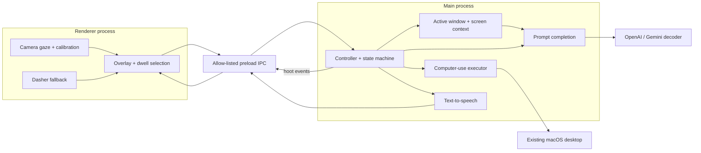

# Hoot — Gaze to Agent

Hoot is a macOS Electron accessibility overlay. A local webcam gaze provider supplies coarse screen coordinates, a prompt-completion engine turns those coordinates into semantic choices, and a computer-use executor carries out confirmed desktop actions.

The primary interaction uses gaze rather than a keyboard, mouse, or speech input. Dasher provides an explicit arbitrary-text fallback when semantic choices do not contain enough information. Hoot keeps the live desktop visible and uses a transparent overlay for selection, confirmation, and safety controls.

## What runs on screen

Hoot owns a transparent overlay with these surfaces:

- A perceived notch and owl sprite provide a stable summon and interrupt target.
- Four large semantic cards appear at screen corners for root choices or around a small active window for refinements.
- Confirmation, consequential-action, interruption, recovery, calibration, and text-entry panels appear only when their state requires them.
- The user's active application remains visible behind the overlay.

Hoot does not render the Article, Email, Shopping, Vertical Feed, or other fixture pages as product tabs. The HTML files under `src/renderer/public/fixtures/` are controlled documents used by tests and demos.

## Interaction model

1. **Setup and calibration.** The live WebEyeTrack provider initializes the camera, collects five calibration targets, measures four held-out targets, and saves the model plus the screen/camera profile.
2. **Passive and summon.** Passive gaze is non-clicking. The user dwells on the owl to summon the agent; the user can also use the `N` key in the deterministic demo.
3. **Semantic composition.** The decoder returns four meaningfully different options. The user dwells on `A`–`D` to select a branch. The user can go back, request more choices, or open the hint/text-entry fallback.
4. **Intent confirmation.** Hoot reads the proposed intent aloud and shows `DO IT`, `CHANGE IT`, `READ / REPEAT`, and `CANCEL`. The user must confirm before any computer-use session starts.
5. **Desktop execution.** The OpenAI Computer Use executor observes fresh screenshots and performs real mouse, keyboard, scroll, drag, type, wait, and screenshot actions. Hoot never simulates desktop actions in live mode.
6. **Safety and recovery.** A consequential action such as sending, posting, deleting, purchasing, paying, booking, or changing an account requires a second approval. The user can interrupt execution and return to passive state.

## Architecture

The README diagram shows runtime boundaries and the request/event flow. It omits individual adapters, CSS, test fixtures, and implementation-only helper classes; [ARCHITECTURE.md](./ARCHITECTURE.md) describes those details.



Runtime ownership follows the process boundary:

| Boundary | Owns |
| --- | --- |
| Renderer | Camera providers, calibration UI, gaze smoothing, dwell hit testing, React overlay, layout, navigation, and Dasher iframe integration |
| Preload bridge | Allow-listed commands and typed `ViewMessage` events between renderer and main process |
| Main process | Active-window discovery, screen capture, prompt completion, interaction state, TTS, telemetry, permissions, and live computer execution |

## Sprite states

The main process sends a `sprite` state in a `ViewMessage`. The renderer derives `dwelling` while the gaze focus remains on the sprite and uses a progress ring for the active dwell. The sprite art and transitions are handled by the overlay.

Current controller and renderer states:

| State | Meaning | Visual behavior |
| --- | --- | --- |
| `idle` | Hoot is passive or has returned from a transient state | Idle owl sheet with gentle motion |
| `dwelling` | The user is holding gaze on the owl | Dwell progress ring and short movement cue |
| `thinking` | The decoder is processing a prompt | Working owl sheet |
| `speaking` | TTS audio is being prepared or played | Working owl sheet |
| `computer_use_running` | The executor is operating the desktop | Working owl sheet |
| `needs_confirmation` | A consequential action is waiting for approval | Red confirmation glow |
| `success` | The executor reported a verified completion | Green completion glow before the passive reset |
| `interrupted` | The user paused computer execution | Amber interruption glow |

Reserved protocol states are available for finer-grained future cues but are not currently emitted by the controller: `attention`, `summoned`, `listening_for_gaze`, `error`, `paused`, and `hidden`.

## Context, layout, and safety

`ContextEngine` reads the active application, window bounds, and a screen capture. Root semantic choices use the screen-corner layout. Refinement choices use the window-halo layout when the active window is large enough.

The live overlay is click-through while the user is passive or composing. Calibration temporarily accepts pointer input because each target requires a click to advance. The overlay uses a floating window with transparency and always-on-top behavior to remain above the desktop.

## Run the application

Requirements:

- macOS and Node.js 20 or newer
- Camera permission for webcam gaze
- Screen Recording permission for active-window context and computer-use screenshots
- Accessibility permission for real mouse and keyboard control
- `OPENAI_API_KEY` for OpenAI decoding and desktop execution, or `GEMINI_API_KEY` for Gemini decoding
- Optional `ELEVENLABS_API_KEY` and `ELEVENLABS_VOICE_ID`; macOS `say` is the default TTS fallback

Create local configuration from the example:

```sh
npm install
cp .env.example .env
```

### Live camera and desktop agent

```sh
npm run agent:live
```

This command builds the app, forces the real WebEyeTrack provider, disables pointer simulation, enables the live OpenAI Computer Use executor, and accepts the explicitly unverified profile used by demo and live hardware runs.

### Strict calibration

```sh
npm run demo:calibrate
npm run demo:recalibrate
```

The first command reuses a matching saved profile; the second command forces a new calibration. Profile reuse requires the same camera, camera resolution, display dimensions, and display scale. The calibration target sequence is deterministic.

For a real-camera run that intentionally skips accuracy checks, use `npm run demo:gaze-unverified`. That mode is an explicit demo setting, not an accuracy claim.

### Deterministic demo

The deterministic provider maps the mouse position to gaze so CI and development can exercise the complete overlay without a camera or decoder API. It never simulates the executor's desktop actions.

```sh
SIMULATE_GAZE=true \
GAZE_PROVIDER=simulated \
DECODER_PROVIDER=fixture \
EXECUTOR_PROVIDER=openai \
EXECUTION_MODE=live \
npm run dev
```

In this mode, `N` summons the agent, `1`–`4` select semantic or confirmation cards, `B` goes back, `M` requests more choices, `H` opens hint entry, and `X` exits. `R` toggles reading navigation.

## Providers and configuration

`.env.example` lists every supported setting. The provider seams currently expose these choices:

| Concern | Providers | Notes |
| --- | --- | --- |
| Gaze | `webeyetrack`, `realeye`, `simulated` | `simulated` is for development and tests; live mode does not fall back to it after camera failure |
| Decoder | `openai`, `gemini`, `fixture` | `fixture` is deterministic; Gemini is a decoder adapter only |
| Executor | `openai` | Computer execution is live-only |
| TTS | `macos`, `elevenlabs`, `mute` | macOS `say` is the default |

Set `DECODER_PROVIDER=gemini`, `GEMINI_API_KEY`, and a compatible `DECODER_MODEL` to use the Gemini decoder. Hoot does not include Gemini computer execution or Gemini speech. The optional semantic fallback remains available through the same prompt-completion flow.

## Navigation modes

Reading mode and vertical-feed mode use edge dwell instead of semantic selections. Reading mode scrolls by a fixed 320-pixel step after a lower-edge or upper-edge dwell. Vertical-feed mode advances through items using the same edge-based mechanics.

## Verify

```sh
npm run typecheck
npm test
npm run verify:webeyetrack
npm run build
npm run test:e2e
```

Unit tests cover state transitions, gaze smoothing and calibration math, prompt validation, layout, navigation, TTS, and the computer-use safety parser. End-to-end tests launch the packaged Electron app and exercise the deterministic provider.

## Repository map

| Path | Responsibility |
| --- | --- |
| `src/main/` | Electron main process, context capture, state orchestration, prompt completion, TTS, telemetry, and computer execution |
| `src/renderer/` | React overlay, gaze providers, calibration UI, dwell selection, layout, navigation, and Dasher assets |
| `src/shared/` | IPC names and shared TypeScript contracts |
| `tests/` | Unit and Electron/Playwright end-to-end tests |
| `scripts/` | Optional asset setup, sprite generation, and WebEyeTrack verification |

Third-party notices for bundled browser and model assets are in [THIRD_PARTY.md](./THIRD_PARTY.md). The technical process and provider deep dive is in [ARCHITECTURE.md](./ARCHITECTURE.md).
