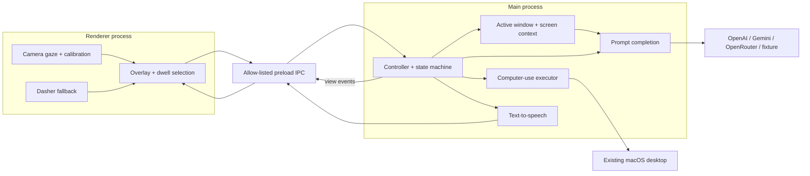

# Hoot — Gaze to Agent

Hoot is a macOS Electron overlay for gaze-based augmentative and alternative communication (AAC) and computer control. A webcam gaze provider estimates a screen point. The renderer turns a deliberate dwell into a semantic choice. The main process accumulates explicit intent, asks a decoder for four next choices, and sends a completed task to an OpenAI computer-use executor.

View targets people who cannot reliably use a mouse, keyboard, or speech input. View does not claim clinical accuracy, speech recognition, permanent accuracy after camera conditions change, or hands-free safety without explicit confirmation at the relevant action boundary.

## Product boundary

View currently provides:

- Gaze selection of large semantic options instead of pixel-level mouse targeting.
- A semantic prompt composer that preserves selected meaning as structured evidence.
- A Dasher-based gaze text-entry fallback for names, words, and arbitrary requests.
- Optional spoken feedback through macOS `say` or ElevenLabs.
- Live desktop execution through OpenAI Computer Use on the existing macOS desktop.
- Reading and vertical-feed navigation based on edge dwell.
- A deterministic simulated-gaze mode for development and demonstrations.

View currently does not provide:

- Speech recognition or a speech-to-text input path. Text-to-speech is output only.
- A mobile client, iPhone Mirroring integration, or app-specific connector layer.
- A dry-run executor. The fixture decoder does not make desktop execution safe or simulated.
- A medical device, diagnosis, rehabilitation measurement, or guaranteed communication channel.
- Automatic fallback from a failed live camera provider to simulated gaze.

The application targets one primary macOS display. It discovers the active macOS window when the optional window-discovery dependency is available and otherwise uses the primary display context.

## What runs on screen

View owns a transparent overlay with these surfaces:

- A perceived notch and owl sprite provide the passive summon target and the execution-interrupt target.
- Four large semantic cards appear at screen corners for root choices and around a smaller active window for refinements.
- A bottom shelf exposes Back, More/None, Spell/Hint, and Exit.
- Confirmation, consequential-action, interruption, recovery, calibration, and text-entry panels appear only when their state requires them.
- The active application remains visible behind the overlay.

View does not render the Article, Email, Shopping, Vertical Feed, or other fixture pages as product tabs. The HTML files under `src/renderer/public/fixtures/` are controlled documents used by tests. View also does not discover, launch, or control an Apple iPhone Mirroring session; a narrow active macOS window still uses the generic window-halo layout.

## Runtime flow

1. **Boot and setup.** The main process checks camera, Screen Recording, and Accessibility permission status. The renderer loads the configured gaze provider. Live mode starts in `SETUP_REQUIRED` until the provider is initialized and calibration is restored or completed.
2. **Calibration.** The live WebEyeTrack provider collects five target positions, measures four held-out positions, and stores a matching camera/display profile. The strict path rejects the profile when the held-out accuracy threshold is not met.
3. **Passive summon.** `PASSIVE` mode does not select arbitrary desktop pixels. The user dwells on the owl to summon the agent. The `N` key provides the same action in the deterministic demo.
4. **Semantic composition.** The root screen presents four broad action families. Each accepted choice adds explicit semantic evidence. The decoder returns four distinct next choices, and the user can select a branch, request `MORE / NONE`, go `BACK`, or open `SPELL / HINT`.
5. **Clarification and text fallback.** After repeated `MORE / NONE` responses, the decoder can ask one short question with four answers. Dasher can provide a word or phrase as a hint, or commit a complete literal request.
6. **Terminal intent.** A `DO THAT`/full-prompt option or `USE FULL REQUEST` produces a natural-language task from the accumulated evidence. The current automatic controller path sends that task directly to `EXECUTING`.
7. **Live desktop execution.** The OpenAI executor captures fresh screenshots and can move, click, double-click, drag, scroll, type, press keys, wait, and inspect the existing desktop. View requires `OPENAI_API_KEY` for this path even when a different decoder provider is selected.
8. **Consequential safety and recovery.** The executor pauses before actions such as sending, posting, deleting, purchasing, paying, booking, or changing an account. The user can approve, change, read/explain, or cancel. Interruptions and provider, permission, or execution failures open a steering or recovery view.

### Current confirmation boundary

The shared protocol defines an `INTENT_CONFIRMATION` state and controller handlers for `YES / DO IT`, `CHANGE IT`, `READ / REPEAT`, and `CANCEL`. The current automatic terminal-selection path does not enter that state: `PromptCompletionEngine` emits `onIntent`, and `InteractionController.handleIntent` moves to `EXECUTING`. The active enforced gate in the live path is `CONSEQUENTIAL_CONFIRMATION`, which pauses a running task before a consequential desktop mutation.

This distinction matters for demos and public claims. The current README describes the running implementation; it does not claim a confirmation screen before every non-consequential task.

## Architecture

The README diagram shows process boundaries and the request/event flow. It omits individual adapters, CSS, test fixtures, and helper classes; [ARCHITECTURE.md](./ARCHITECTURE.md) contains the deeper process and provider notes.



Runtime ownership follows the process boundary:

| Boundary | Owns |
| --- | --- |
| Renderer | Camera providers, calibration UI, gaze smoothing, dwell hit testing, React overlay, layout, navigation, audio playback, and Dasher iframe integration |
| Preload bridge | Allow-listed commands and typed `ViewMessage` events between renderer and main process |
| Main process | Active-window discovery, screen capture, prompt completion, interaction state, TTS requests, telemetry, permissions, and live computer execution |

## Interaction state machine

The shared `InteractionState` union defines the protocol vocabulary. The following states are used or represented by the current runtime:

| State | Role |
| --- | --- |
| `BOOT` | Main-process initialization is in progress. |
| `SETUP_REQUIRED` | Live gaze setup or a required permission/profile action is pending. |
| `CALIBRATING` | The renderer is collecting gaze calibration samples. |
| `CALIBRATION_ERROR` | Calibration failed and the user can retry or recalibrate. |
| `PASSIVE` | The overlay waits for an owl summon or a navigation-mode edge dwell. |
| `AGENT_LOADING` | The controller prepares context and warms the decoder. |
| `SEMANTIC` | Four semantic options and the prompt shelf are available. |
| `DECODING_ALT` | A decoder request or continuation update is in flight. |
| `SEMANTIC_PAUSED` | Gaze confidence was lost during a gaze-driven semantic flow. A restored sample returns the machine to its saved prior state. |
| `FALLBACK_TEXT` | Dasher or literal text entry is available. |
| `EXECUTING` | The OpenAI computer-use executor is operating the desktop. |
| `CONSEQUENTIAL_CONFIRMATION` | The executor is waiting for approval before a consequential action. |
| `EXECUTION_INTERRUPTED` | The user interrupted execution and must choose continue, stop, go back, or change something. |
| `COMPLETE` | The executor reported a verified completion; the controller returns to `PASSIVE` after a short result cue. |
| `ERROR_RECOVERY` | A provider, permission, capture, or executor error exposes retry, back, choose-something-else, and stop actions. |

The prompt view has a second, more specific mode: `predict`, `clarify`, or `hint`. After repeated `MORE / NONE` responses, `PromptCompletionEngine` sets `PromptViewState.mode` to `clarify`; the current controller commonly keeps the outer machine in `SEMANTIC` while the prompt view displays the clarification question.

The protocol also contains `CLARIFYING`, `INTENT_CONFIRMATION`, `CONFIRM_ACTION`, and `ERROR` values. `CLARIFYING` and `INTENT_CONFIRMATION` have transition definitions or handlers, but the current automatic flow does not consistently enter those outer states. `CONFIRM_ACTION` is retained in the shared type contract and is not emitted by the current controller. Failures normally route to `ERROR_RECOVERY`.

## Sprite states

The main process sends a compact `sprite` state in a `ViewMessage`. The renderer derives `dwelling` while the gaze focus remains on the sprite and uses a progress ring for the active dwell. The sprite state is visual status; it is not the complete interaction state machine.

| Sprite state | Meaning | Visual behavior |
| --- | --- | --- |
| `idle` | View is passive or has returned from a transient state. | Idle owl sheet with gentle motion. |
| `attention` | Reserved attention cue. | Not currently emitted by the controller. |
| `dwelling` | The user is holding gaze on a selectable sprite target. | Dwell progress ring and short movement cue. |
| `summoned` | Reserved summon transition cue. | Not currently emitted by the controller. |
| `listening_for_gaze` | Reserved active-gaze cue. | Not currently emitted by the controller. |
| `thinking` | The decoder is processing a request. | Working owl sheet. |
| `speaking` | TTS audio is being prepared or played. | Working owl sheet. |
| `computer_use_running` | The executor is operating the desktop. | Working owl sheet. |
| `needs_confirmation` | A consequential action is waiting for approval. | Red confirmation glow. |
| `success` | The executor reported a verified completion. | Green completion glow before the passive reset. |
| `interrupted` | The user paused computer execution. | Amber interruption glow. |
| `error` | Reserved error cue. | Not currently emitted as a normal controller sprite event. |
| `paused` | Reserved paused cue. | Not currently emitted as a normal controller sprite event. |
| `hidden` | Reserved hidden cue. | Not currently emitted as a normal controller sprite event. |

The artwork currently uses an idle sheet for non-working states and a working sheet for `thinking`, `speaking`, and `computer_use_running`. The exact sprite contract is defined in `src/shared/types.ts`; visual assets and generation scripts live under `src/renderer/` and `scripts/`.

## Gaze model, training, and calibration

The primary `webeyetrack` path uses the bundled upstream TensorFlow.js model at `src/renderer/public/web/model.json`. The model contains a convolutional neural-network encoder named `cnn_encoder` with convolutional and depthwise-convolutional layers, followed by a `gaze_mlp` head.

View does not train or fine-tune that CNN during normal use. The provider loads the bundled pretrained weights and sets `adaptOnClick: false`. Calibration does not update neural weights. Calibration collects user-specific samples and fits a CPU-side 2×3 affine screen-coordinate correction on top of the fixed network output.

The strict WebEyeTrack path currently behaves as follows:

1. It targets the center and four near-corner positions.
2. It collects three fresh valid samples per target over a settling interval.
3. It fits the affine screen correction while keeping the neural model fixed.
4. It measures four held-out positions.
5. It accepts the profile only when every held-out target has at least five valid frames and at least 70% of measured frames fall within normalized distance `0.25`.
6. It stores the model artifact in IndexedDB and camera/display metadata in local storage.

A saved profile is reusable only when the camera identity and resolution, viewport dimensions, display scale, and calibration metadata match. `FORCE_CALIBRATION=true` bypasses profile reuse. `ALLOW_UNVERIFIED_GAZE=true` allows the demo path to skip the four held-out checks, but it still uses real camera frames and does not establish accuracy.

The optional `realeye` provider delegates gaze estimation and calibration to the RealEye package. It has separate asset and licensing requirements documented in [THIRD_PARTY.md](./THIRD_PARTY.md). The `simulated` provider maps mouse position to gaze for development and tests; live camera failure does not switch to it.

Camera failure disables gaze and opens setup/recovery. View does not silently replace a failed camera provider with pointer input.

## Semantic prompt completion

View separates gaze estimation from language completion:

1. The renderer supplies a selected quadrant, dwell event, hint, or navigation action.
2. The main process stores explicit semantic evidence such as an operation, target, recipient, or constraint.
3. The prompt engine sends the display prompt, evidence, hints, rejected option sets, clarification answers, user lexicon, and optional context to the selected decoder.
4. The decoder returns structured JSON with exactly four candidates, a normalized prompt, executable status, open slots, and candidate metadata.
5. Local schema and semantic validation checks required fields, candidate count, duplicate IDs, label length, model-score ranges, and preservation of explicit lexical evidence. Invalid OpenAI and OpenRouter responses can receive one repair request. Gemini responses are rejected when local validation fails. When OpenAI or OpenRouter is primary and `GEMINI_API_KEY` is configured, Gemini automatically retries failed decoder and clarification requests.
6. The engine maps the accepted candidates to quadrants and either continues composition or emits a terminal natural-language task.

The decoder prompt treats selected evidence as authoritative. Context from the active application or screen is weak evidence and cannot silently add a person, date, target, reason, tone, or consequential instruction. Candidate validation also flags candidates that introduce meaning not present in selected evidence, hints, or the user lexicon.

YouTube is a known app in the default lexicon. Selecting it opens `https://www.youtube.com` in the browser and speaks the next choice prompt. The four follow-up cards are `RANDOM FROM HOMEPAGE`, `RANDOM FROM FIRST PAGE`, `PICK SOMETHING SPECIFIC`, and `SEARCH / BROWSE YOUTUBE`; no video is played until one of those choices is selected.

The root set is deterministic and covers broad action families. The decoder is not asked to infer a specific task from the user lexicon before the user has selected a direction. When the user selects `MORE / NONE`, the engine records the rejected set. After two such responses, the engine can ask one high-information clarification question with four mutually distinct answers. A further rejected clarification can open the text fallback.

Media services receive a deterministic refinement rule. After the user selects Spotify, Apple Music, YouTube, YouTube Music, SoundCloud, Tidal, or Pandora, View does not infer a song or playlist. The next set separates opening the service, playing a song/video, playing a collection, and searching or browsing as applicable to that service.

The engine can prefetch a likely continuation while the user is beginning a dwell. Prefetch is disabled for Gemini to avoid duplicate paid requests and request races. Telemetry records prefetch hits, misses, and the time required to apply a prefetched view. `TTSService` exposes a bounded text prefetch cache, but the current controller does not schedule that cache yet; `TTS_PREFETCH_ENABLED` is configuration-ready rather than an active runtime feature.

### Dasher fallback

Dasher provides gaze-based arbitrary text entry inside the fallback panel. The user can:

- Use the generated text as a decoder hint and continue semantic composition.
- Select a suggested candidate generated from the hint.
- Use the text as a complete literal request, which enters the same live executor path as a terminal semantic option.

The keyboard can add letters, numbers, spaces, and backspaces to the hint field during development and demonstrations. Keyboard entry does not replace the gaze text-entry path.

## Context, layout, and navigation

`ContextEngine` periodically discovers the active application and window, classifies the surface, records the current gaze anchor, and captures a screen image when context is requested. The snapshot can contain:

- Active application name and window title.
- Active application URL when the optional window-discovery provider exposes it.
- Surface type such as document, feed, media player, email, shopping, search, maps, editor, form, or generic application.
- Window bounds and the normalized gaze anchor.
- A low-resolution screen capture and its dimensions/timestamp.

Root semantic choices use a screen-corner layout. Refinement choices use a window-halo layout when the active window is substantially smaller than the display. The layout uses geometry and surface metadata rather than fixture page names.

Reading mode and vertical-feed mode use edge dwell instead of semantic options:

- Reading mode scrolls by a fixed 320-pixel step after an upper- or lower-edge dwell.
- Vertical-feed mode advances or reverses by one 720-pixel item step.
- The center remains inactive for these modes.
- A cooldown limits repeated scrolls.
- The main process validates that the saved gaze anchor is inside the active window before sending a live scroll action.

## Data flow and privacy boundary

View is not local-only when cloud providers are enabled. The following table describes the current code path:

| Data | Local operation | Possible external recipient |
| --- | --- | --- |
| Camera frames and gaze samples | WebEyeTrack or RealEye inference runs in the renderer/provider runtime. Calibration metadata is stored locally. | The decoder adapters do not receive camera frames. |
| Active-window metadata and prompt evidence | The main process builds a structured decoder input. | The configured OpenAI, Gemini, or OpenRouter decoder receives the text and metadata. |
| Screen-context image | The main process captures the active window at roughly 512 pixels wide when possible, with a primary-display fallback. | The OpenAI decoder receives the image as a low-detail input, and the Gemini decoder can receive the image. The current OpenRouter adapter removes `capturedImageDataUrl` and sends structured metadata only. |
| Computer-use screenshots and task instructions | The executor captures fresh desktop screenshots and runs returned actions locally through the computer-use adapter. | OpenAI Computer Use receives screenshots, task instructions, and action results. |
| Spoken feedback text | macOS `say` synthesizes audio locally, or the renderer plays returned audio. | ElevenLabs receives text when `TTS_PROVIDER=elevenlabs`. `mute` sends no TTS request. |
| Calibration/model profile | The browser stores the WebEyeTrack artifact in IndexedDB and camera/display profile metadata in local storage. | No calibration image or individual gaze coordinate is sent by the profile-storage path. |

API keys are loaded from `.env` and process environment variables. `.env` is ignored by Git. Review the privacy and retention policies of each enabled provider before using View over sensitive screens.

## Providers and configuration

The checked-in `.env.example` is configured for a real-camera launch with ElevenLabs TTS, OpenRouter/DeepSeek decoding, and the OpenAI executor. When variables are absent, `src/main/config.ts` falls back to WebEyeTrack, macOS `say`, and the OpenAI decoder. The executor remains OpenAI and defaults to `gpt-6-astra`.

| Concern | Supported values | Current behavior |
| --- | --- | --- |
| Gaze | `webeyetrack`, `realeye`, `simulated` | `webeyetrack` is the primary live provider. `simulated` is for development/tests. |
| Decoder | `openai`, `gemini`, `openrouter`, `fixture` | `fixture` is deterministic and local. `openrouter` uses the configured DeepSeek-compatible model. |
| Executor | `openai` | Live desktop execution only; no executor simulator is provided. |
| TTS | `macos`, `elevenlabs`, `mute` | macOS `say` is local. ElevenLabs requires both an API key and voice ID. |

Required or provider-specific variables:

| Variable | Required when | Purpose |
| --- | --- | --- |
| `OPENAI_API_KEY` | Live desktop execution, or `DECODER_PROVIDER=openai` | OpenAI Computer Use and/or OpenAI semantic decoder access. |
| `EXECUTOR_MODEL` | Optional | Computer-use model; the current default is `gpt-6-astra`. |
| `GEMINI_API_KEY` | `DECODER_PROVIDER=gemini` | Gemini decoder access. |
| `OPENROUTER_API_KEY` | `DECODER_PROVIDER=openrouter` | OpenRouter decoder access. |
| `DECODER_MODEL` | Optional | Decoder model; the example uses `deepseek/deepseek-v4-flash-0731` for OpenRouter. |
| `ELEVENLABS_API_KEY` and `ELEVENLABS_VOICE_ID` | `TTS_PROVIDER=elevenlabs` | ElevenLabs speech synthesis. |

Interaction and behavior settings include:

| Variable | Default | Effect |
| --- | ---: | --- |
| `GAZE_DWELL_MS` | `1500` | Semantic-card dwell duration. |
| `AGENT_SUMMON_DWELL_MS` | `900` | Owl summon dwell duration. |
| `NONE_DWELL_MS` | `700` | `MORE / NONE` shelf dwell duration. |
| `CANCEL_DWELL_MS` | `900` | Exit/cancel shelf dwell duration. |
| `HINT_DWELL_MS` | `650` | Spell/hint shelf dwell duration. |
| `GAZE_EMA_ALPHA` | `0.28` | Exponential moving-average smoothing for gaze points. |
| `GAZE_CONFIDENCE_MIN` | `0.5` | Minimum accepted gaze confidence. |
| `DUPLICATE_THRESHOLD` | `0.82` | Similarity threshold used by candidate diversification. |
| `AUTO_SCROLL_ENABLED` | `true` | Configuration is present, but the current navigation controller does not read this flag. |
| `PREFETCH_ENABLED` | `true` | Enables speculative decoder continuations where supported. |
| `TTS_PREFETCH_ENABLED` | `true` | Configuration is present, but the current controller does not schedule TTS prefetch. |
| `SPEAK_OPTION_ON_HOVER` | `false` | Configuration is present, but hover speech is not wired in the current controller. |
| `GAZE_CONFIDENCE_MIN` | `0.5` | Configuration is present, but live validity currently comes from the gaze provider's valid/invalid sample result. |
| `DEBUG_HUD` | `false` | Shows gaze, state, provider, and telemetry diagnostics. |
| `REDUCED_ANIMATION` | `false` | Reduces overlay animation. |

Demo and calibration variables include `SIMULATE_GAZE`, `FORCE_CALIBRATION`, and `ALLOW_UNVERIFIED_GAZE`. `EXECUTOR_PROVIDER` and `EXECUTION_MODE` are shown in `.env.example`, but the current configuration fixes the executor to OpenAI and the execution mode to live. The full set, including ElevenLabs voice tuning, is in [.env.example](./.env.example).

## Run the application

Requirements:

- macOS.
- Node.js 20 or newer.
- Camera permission for webcam gaze.
- Screen Recording permission for active-window context and computer-use screenshots.
- Accessibility permission for live mouse, keyboard, and scroll control.
- `OPENAI_API_KEY` for live desktop execution.
- A decoder key matching `DECODER_PROVIDER`, unless `DECODER_PROVIDER=fixture`.
- `ELEVENLABS_API_KEY` and `ELEVENLABS_VOICE_ID` only when ElevenLabs TTS is selected.

Install dependencies and create local configuration:

```sh
npm install
cp .env.example .env
```

Useful commands:

```sh
npm run dev       # Electron development server
npm run build     # Production renderer/main build
npm run start     # Preview the production build
npm run setup     # Set up optional local assets when required
```

### Live camera and desktop agent

```sh
npm run agent:live
```

This command builds the app, selects the real WebEyeTrack provider, disables pointer simulation, enables the live OpenAI executor, and allows the full demo to accept an explicitly unverified gaze profile. The unverified profile still uses camera frames but skips the four held-out accuracy checks. Runtime diagnostics are written to `/tmp/view-live.log`.

After setup reports an active calibration, look at the owl, compose a request, select a terminal option, and observe the consequential-action gate when the executor identifies one. Because the current terminal path enters `EXECUTING` directly, use a controlled desktop and a non-consequential demonstration request unless you are deliberately testing the safety flow.

### Strict calibration

```sh
npm run demo:calibrate
npm run demo:recalibrate
```

The first command can reuse a matching saved profile. The second command forces a new calibration. Profile reuse requires the same camera, camera resolution, display dimensions, and display scale. The saved WebEyeTrack artifact contains the fixed neural model and the CPU-fitted screen correction. Calibration logs record timings, frame counts, fit error, RMSE, and 95th-percentile error without recording camera images or individual gaze coordinates.

For a real-camera run that intentionally skips accuracy checks, use:

```sh
npm run demo:gaze-unverified
```

That mode is an explicit demo setting, not an accuracy claim.

### Deterministic demo

The deterministic provider maps mouse position to gaze so development and CI can exercise the overlay without a camera. The fixture decoder avoids network decoder calls. The executor remains live-only, so a terminal task can still require `OPENAI_API_KEY` and can still operate the desktop.

```sh
SIMULATE_GAZE=true \
GAZE_PROVIDER=simulated \
DECODER_PROVIDER=fixture \
EXECUTOR_PROVIDER=openai \
EXECUTION_MODE=live \
npm run dev
```

Hold `Shift` to freeze the simulated gaze point while testing a dwell.

## Keyboard controls

Keyboard controls support deterministic demonstrations, test setup, and recovery when the overlay is focused. They are not the primary product input path.

| Key | Action |
| --- | --- |
| `N` | Summon from `PASSIVE`; interrupt execution when `EXECUTING` or a consequential prompt is active. |
| `1`–`4` | Select quadrant A–D in semantic, consequential, interruption, or recovery views. |
| `B` | Go back in composition. |
| `M` | Request more choices / record `NONE`. |
| `H` | Open the Dasher hint panel. |
| `X` | Exit the semantic session or navigation mode. |
| `R` | Toggle reading mode while passive. |
| `F` | Toggle vertical-feed mode while passive. |
| `Cmd/Ctrl+D` | Toggle the debug HUD. |
| `Esc` | Cancel an active calibration flow. |
| Letters, numbers, space, Backspace, Enter | Edit or commit the Dasher hint field during the fallback flow. |

## Safety and known limitations

- The current automatic terminal path bypasses the separate `INTENT_CONFIRMATION` state. The live executor does enforce a consequential-action confirmation boundary, but the project should not describe every task as requiring a pre-execution confirmation until the controller path is changed.
- The executor is live-only. View does not provide a dry-run, mock desktop, or automatic rollback for external actions.
- `ALLOW_UNVERIFIED_GAZE` skips held-out accuracy validation. It does not improve the model or establish reliable gaze accuracy.
- Camera, Screen Recording, Accessibility, decoder, executor, and TTS failures surface as setup notices or recovery choices. View does not silently retry by changing the user's selected provider.
- Cloud decoder, executor, and TTS providers can receive the data listed in the data-flow table. Use `macos` or `mute` when local or silent speech output is required.
- The current capture path is macOS-specific and uses the primary display or the discovered active window. Multi-display and mobile workflows are not productized.
- Physical gaze accuracy depends on camera position, lighting, seating, display scale, and user movement. Calibration must be repeated when the saved profile no longer matches those conditions.
- The project is a technical prototype and accessibility demonstration. It is not a clinical communication guarantee.

## Verify

```sh
npm run typecheck
npm test
npm run verify:webeyetrack
npm run build
npm run test:e2e
```

Unit tests cover state transitions, gaze smoothing and calibration math, prompt schema and semantic validation, candidate diversification, layout, navigation, TTS, provider adapters, and computer-use safety parsing. End-to-end tests launch the packaged Electron renderer and exercise summon, stationary dwell, Dasher entry, navigation, and calibration flows. Physical camera accuracy and live provider calls require the permissions, hardware, network, and credentials listed above.

## Repository map

| Path | Responsibility |
| --- | --- |
| `src/main/` | Electron main process, context capture, state orchestration, prompt completion, TTS, telemetry, permissions, and computer execution |
| `src/main/context/` | Active-window discovery, surface classification, screen capture, and gaze-anchor context |
| `src/main/prompt-completion/` | Decoder adapters, structured schemas, semantic evidence, hint handling, validation, diversification, and speculative prefetch |
| `src/main/state/` | Interaction controller and state-machine transitions |
| `src/main/executor/` | OpenAI Computer Use adapter, action execution, screenshot exchange, interruption, and consequential-action gating |
| `src/renderer/` | React overlay, gaze providers, calibration UI, smoothing, dwell selection, layout, navigation, and Dasher integration |
| `src/renderer/public/` | Bundled WebEyeTrack assets, model files, sprite assets, Dasher, and test fixtures |
| `src/shared/` | IPC names and shared TypeScript contracts |
| `tests/` | Unit and Electron/Playwright end-to-end tests |
| `scripts/` | Optional asset setup, sprite generation, and WebEyeTrack verification |

Third-party notices for bundled browser and model assets are in [THIRD_PARTY.md](./THIRD_PARTY.md). The technical process and provider deep dive is in [ARCHITECTURE.md](./ARCHITECTURE.md). The live component contract is in [COMPONENTS.md](./COMPONENTS.md).
