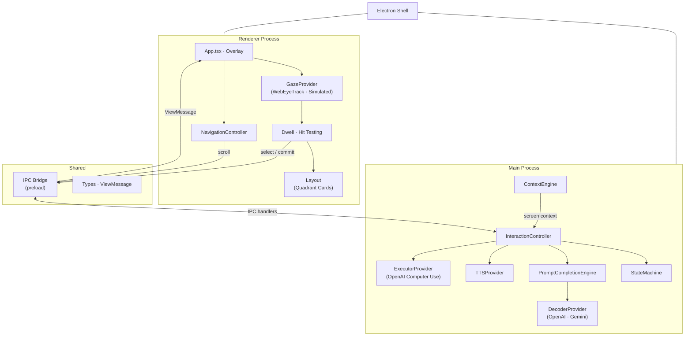

# View — Gaze to Agent

View is a hands-free macOS desktop assistant. A webcam tracks where you look, an LLM interprets your intent, and a computer-use agent executes the result — all without a keyboard, mouse, or voice.

The interface lives in the macOS notch area. When you look at the sprite, four semantic option cards appear around the screen. You refine your intent by dwelling on cards with your eyes until the system understands what you want. Once confirmed, an AI agent (OpenAI Computer Use) operates the desktop on your behalf. A Dasher-style gaze keyboard is available for free-text entry.

## How it works

1. **Gaze** — a webcam eye-tracker samples where you're looking and smooths the signal.
2. **Prompt completion** — an LLM (OpenAI or Gemini) generates four semantic options from screen context. You narrow your intent by selecting cards; the tree refines until a concrete action emerges.
3. **Confirmation** — consequential actions (send, delete, purchase) require an explicit second confirmation via gaze dwell.
4. **Execution** — an OpenAI Computer Use agent carries out the confirmed action with real mouse and keyboard input.
5. **Recovery** — if anything fails or the action is declined, the system returns to a safe idle state.

## Architecture



## Run the live application

Requirements:

- macOS and Node.js 20 or newer
- Camera permission for webcam gaze
- Screen Recording permission for desktop context and Computer Use screenshots
- Accessibility permission for mouse and keyboard control
- `OPENAI_API_KEY` for OpenAI decoding and desktop execution, or `GEMINI_API_KEY` for Gemini decoding
- Optional `ELEVENLABS_API_KEY` and `ELEVENLABS_VOICE_ID`; otherwise set `TTS_PROVIDER=macos`

```sh
npm install
cp .env.example .env
npm run dev
```

The production defaults select the pinned `otree-et`-patched WebEyeTrack build, OpenAI decoding, OpenAI Computer Use, live execution, and real screen capture. The application self-hosts WebEyeTrack's model and MediaPipe assets. The notch character is currently the only placeholder visual.

The current demo scope excludes Apple iPhone Mirroring integration. View can place cards around any narrow active macOS window, but it does not discover, launch, or control an iPhone-side session.

### Run and diagnose live calibration

```sh
npm run demo:calibrate
```

For a single real-camera demo that saves the five-point fit and starts gaze without accuracy checks, run `npm run demo:gaze-unverified`. This explicit mode never uses mouse simulation, but it cannot guarantee correct selections. The ordinary calibration command remains strict.

On the first run, click **Start eye calibration**. Look at each dot, click it, and keep looking until it moves. Calibration uses five positions and four independent accuracy checks. After a successful save, the same command shows **Start eye control** and reuses the profile without repeating the dots. Reuse requires the same camera, camera resolution, display dimensions, and display scale. Choose **Recalibrate** if your seating position changes or accuracy deteriorates; `npm run demo:recalibrate` explicitly starts a fresh calibration.

The command builds a stable preview without development hot reload, selects the live WebEyeTrack provider, disables simulated gaze, and writes structured diagnostics to `/tmp/view-calibration.log`. Calibration now fits a CPU coordinate correction from three fresh, unsmoothed predictions at each position. It does not retrain the neural network. The saved model artifact includes that correction; previous weight-only profiles are incompatible and require one new calibration. See [the calibration contract](./COMPONENTS.md#live-calibration-contract).

The log records a session ID, frame counts, numerical accuracy errors, and explicit failures, but no camera images or gaze coordinates. To inspect a trace:

```sh
grep -a '\[calibration\]' /tmp/view-calibration.log | tail -80
```

## Explicit demo mode

The deterministic providers exist only for development, CI, and machines without camera or API access. Set these values in `.env`:

```dotenv
GAZE_PROVIDER=simulated
SIMULATE_GAZE=true
DECODER_PROVIDER=fixture
EXECUTOR_PROVIDER=openai
EXECUTION_MODE=live
```

Mouse position supplies continuous gaze samples in this mode. The product overlay does not render fixture tabs or fake applications; controlled fixture pages remain test-only assets. Desktop execution is never simulated, and confirming a task without `OPENAI_API_KEY` shows the recovery card.

## Verify

```sh
npm run typecheck
npm test
npm run verify:webeyetrack
npm run build
npm run test:e2e
```

The end-to-end suite launches the packaged Electron renderer. Calibration tests use an isolated browser profile and an explicitly scripted worker dependency to verify five-point collection, four-check validation, save/restart, and hard failures; they do not demonstrate physical eye-tracking accuracy. The vendor verification command also tests the real calibration math and bundled neural model save/restore. Physical camera accuracy requires a user looking at the targets.

## Provider research and portability

The provider seams are deliberately small. `GeminiFlashLiteProvider` now implements `DecoderProvider` through the `@google/genai` Interactions API, requests structured JSON, and passes the existing local schema and semantic validators. Enable it with `DECODER_PROVIDER=gemini`, `GEMINI_API_KEY`, and `DECODER_MODEL=gemini-3.5-flash-lite`. `ExecutorProvider` and `TTSProvider` remain separate; this change does not add Gemini computer execution or Gemini speech. `SemanticEmbeddingProvider` remains only an optional local candidate-diversity optimization, so embeddings are not required for Gemini decoding.

Reference the official Gemini documentation for API behavior and model availability:

- [Models](https://ai.google.dev/gemini-api/docs/models)
- [JavaScript getting started](https://ai.google.dev/gemini-api/docs/get-started)
- [Structured output](https://ai.google.dev/gemini-api/docs/structured-output)
- [Computer use](https://ai.google.dev/gemini-api/docs/computer-use)
- [Embeddings](https://ai.google.dev/gemini-api/docs/embeddings)
- [Text-to-speech](https://ai.google.dev/gemini-api/docs/speech-generation)

Third-party notices for bundled browser assets are in [THIRD_PARTY.md](./THIRD_PARTY.md).

See [COMPONENTS.md](./COMPONENTS.md) for the boundary between the product overlay, gaze infrastructure, and development-only fixtures, and [ARCHITECTURE.md](./ARCHITECTURE.md) for the full runtime flow.
