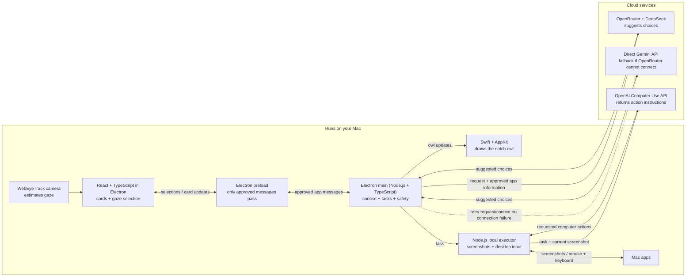

# Hoots: use a Mac with your eyes

Hoot lets people control a Mac using ordinary webcam gaze, including people with severe motor impairments or paralysis who may not be able to reliably use a mouse or keyboard. Webcam gaze is too noisy for precise cursor control, so Hoot uses four large semantic choices to progressively determine what the user wants to do. Once the intent is clear, a computer-use agent performs the precise mouse and keyboard actions across ordinary Mac applications.

## What Hoots does

- Shows an owl near the top of the screen to open Hoots or interrupt an active task.
- Shows four large choices at a time, plus Back, More, and Exit controls.
- Uses information from an open app you allow Hoots to read. Hoots starts reading after a session begins and stops when you pause or exit.
- Can speak brief feedback using a macOS voice or ElevenLabs.
- Asks for approval before sensitive actions, such as sending a message or making a purchase.

Camera gaze is the normal way to select cards. Mouse input is available for testing. Hoots does not include speech recognition.

## Owl state guide

The owl uses two eight-frame animations. Hoots selects an animation from the current interaction state and adds gaze-progress or status cues where needed; it does not use separate artwork for every state.

| Animation | Preview | Runtime states |
| --- | --- | --- |
| Idle |  | `idle`, `dwelling`, `needs_confirmation`, `success`, `interrupted` |
| Working |  | `thinking`, `speaking`, `computer_use_running` |

While the owl is `dwelling`, the gaze-progress ring fills as you look at it. A red glow on `needs_confirmation` marks an action that needs approval; green on `success` marks task completion; orange on `interrupted` marks an interruption. The previews shorten the animation timing so the movement is visible quickly; runtime timing and state mapping are defined in [the overlay styles](./src/renderer/styles.css) and [the native notch host](./native/NotchHost.swift).

## Architecture at a glance


```mermaid
flowchart LR
    subgraph local["Runs on your Mac"]
        camera["WebEyeTrack camera<br/>estimates gaze"] --> ui["React + TypeScript in Electron<br/>cards + gaze selection"]
        ui <-->|"selections / card updates"| bridge["Electron preload<br/>only approved messages pass"]
        bridge <-->|"approved app messages"| main["Electron main (Node.js + TypeScript)<br/>context + tasks + safety"]
        main -->|"owl updates"| notch["Swift + AppKit<br/>draws the notch owl"]
        main -->|"task"| executor["Node.js local executor<br/>screenshots + desktop input"]
        executor <-->|"screenshots / mouse + keyboard"| desktop["Mac apps"]
    end

    subgraph cloud["Cloud services"]
        decoder["OpenRouter + DeepSeek<br/>suggests choices"]
        gemini["Direct Gemini API<br/>fallback if OpenRouter cannot connect"]
        computer["OpenAI Computer Use API<br/>returns action instructions"]
    end

    main -->|"request + approved app information"| decoder
    decoder -->|"suggested choices"| main
    main -.->|"retry request/context on connection failure"| gemini
    gemini -->|"suggested choices"| main
    executor -->|"task + current screenshot"| computer
    computer -->|"requested computer actions"| executor
```

WebEyeTrack estimates gaze on the Mac; Hoots does not send camera video to an AI service. The request, app-context, and screenshot labels show what Hoots sends to cloud services.

## Run Hoots

You need macOS and Node.js 20 or newer. Live model and computer-control features also need provider keys in `.env`.

```sh
npm install
cp .env.example .env
```

Add the keys for your chosen providers to `.env`. Camera gaze needs Camera permission. App screenshots and computer control need Screen Recording permission. Mouse, keyboard, and scrolling actions need Accessibility permission.

| Command | What it does |
| --- | --- |
| `npm run dev` | Starts Hoots in development mode. |
| `npm run demo:calibrate` | Opens Hoots to set up or check camera gaze. |
| `npm run agent:live` | Starts the camera-based demo with live OpenAI Computer Use. |
| `npm run demo:simulate` | Uses the mouse instead of the camera. It still sends requests to DeepSeek and can control your Mac through OpenAI. |
| `npm run demo:recalibrate` | Repeats camera setup. |

To test predictable choices without calling a model service, set `DECODER_PROVIDER=fixture` in `.env` and run `npm run dev`. This only changes the choices. If you select **Run this**, Hoots still uses live computer control.

## Providers

| Feature | Service |
| --- | --- |
| Camera gaze | WebEyeTrack |
| Test gaze | Mouse position |
| Choice suggestions | DeepSeek through OpenRouter; the direct Gemini API is an optional fallback for connection failures. |
| Computer control | OpenAI Computer Use |
| Spoken feedback | macOS voice, ElevenLabs, or off |

See [.env.example](./.env.example) for provider settings. [The choice-generation guide](./docs/DECODER_ARCHITECTURE.md) explains how Hoots turns gaze choices into requests and handles model errors.

## App information and screen recording

After a session starts, Hoots can read information from the approved open app to improve its choices. `PAUSE` stops these updates and clears the captured image. [The app information guide](./docs/CONTEXT_ACQUISITION.md) explains what Hoots reads and when.

Other apps normally cannot capture Hoots' overlay. To include the cards and owl in a screen recording, run:

```sh
HOOTS_RECORDING_MODE=true npm run agent:live
```

The screen recorder can show Hoots' overlay. Hoots sends the computer-control service a separate screenshot with its own windows excluded.

## Project guides

- [Architecture](./ARCHITECTURE.md): how the app's processes and services work together.
- [Components](./COMPONENTS.md): what appears on screen and how gaze selection works.
- [App information](./docs/CONTEXT_ACQUISITION.md): what information Hoots reads from open apps.
- [Choice generation](./docs/DECODER_ARCHITECTURE.md): how Hoots builds requests and gets choice suggestions.
- [Integration roadmap](./docs/INTEGRATION_ROADMAP.md): planned information sources.
- [Verification and limits](./docs/LATENCY_AND_TASK_AWARE_CARDS_VERIFICATION.md): automated checks and what still needs live testing.
- [Third-party notices](./THIRD_PARTY.md): licenses for bundled libraries and assets.

## Check the code

```sh
npm run typecheck
npm test
npm run build
npm run test:e2e
```
