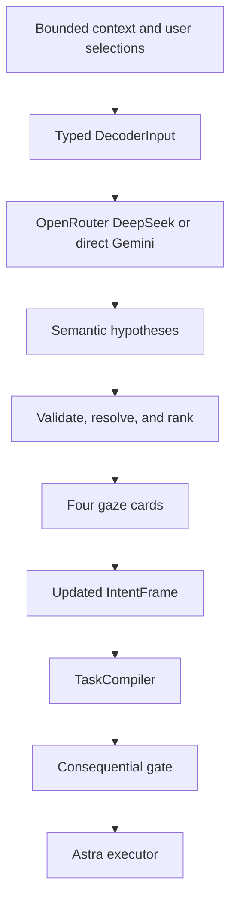

# Hoot decoder architecture

This document defines the decoder boundary for implementation and review.
The renderer owns gaze sampling and dwell selection. The main process owns
intent composition, context policy, ranking, task compilation, and execution.

## End-to-end data flow



## Authoritative state

`IntentFrame` in `src/shared/intent.ts` stores semantic fields, authored
fragments, evidence references, unresolved slots, rejected hypotheses, and a
state (`forming`, `needs_clarification`, `semantically_complete`, or
`ready_for_execution`). Every field value carries an `EvidenceSource`.

The authority order is:

```text
user_explicit > user_selected > resolved_entity > foreground_context
> recent_context > background_context > model_inference
```

`normalizedPrompt` and `resultingPrompt` are presentation strings. The host
never uses those strings to recover or validate user meaning. A decoder can
paraphrase a selected phrase without losing intent because `applySemanticFragment`
and `applyIntentPatch` retain the typed fields and provenance.

## Context and target resolution

`ContextEngine` is the permission boundary. The engine enables context
only for a summoned session, limits captures to an approved active window, and
stops collection when the session pauses or exits.

`ContextLedger` in `src/main/context/ContextLedger.ts` stores a small bounded
history of weak observations. The ledger can contain app metadata, window and
document references, focused controls, selected text, and visible text. The
ledger is open-world: an absent observation does not exclude a file, app,
contact, URL, or other target.

`TargetResolver` in `src/main/context/TargetResolver.ts` resolves a target on
demand against installed-app metadata, recent files, contacts, directories,
bookmarks, and ledger references. A miss produces an empty result,
not a negative fact. A resolved entity receives a stable ID and remains below
explicit user evidence in the authority order.

The resolver warms a bounded local index during session preparation. On macOS,
it enumerates application bundles in the standard Applications folders and the
top two levels of Desktop, Documents, and Downloads for recent file names. An
explicit URL remains an open-world target. The resolver never reads an entire
home directory, uploads file contents, or treats the index as an
allowlist. Optional comma-separated personal vocabulary is merged and filtered
by `PersonalizationLexicon` for each request; personalization changes ranking,
not provenance.

## Hypotheses and card ranking

When a session starts with a strong, approved foreground surface, `ContextPrediction`
can publish four whole-intent proposals before the first decoder request. The
module uses only surface metadata and a registered reference: a document offers
summarize, explain, or find; a message offers reply or summarize; a media
surface offers continue, search, or open. The fourth card is another
context-grounded operation. The proposals are still continuations, and
selection applies their patch with `user_selected` provenance. If the context
is generic, blocked, paused, or absent, the engine publishes the deterministic
root instead.

`DecoderProvider` returns an internal pool instead of a display set. The JSON
schema requires eight to twelve candidates for live providers. The fixture
provider is an in-process test seam and may use a smaller branch only when a
test explicitly injects it. Each candidate may carry
an `intentPatch`; `continuation` is the compact wire representation used when a
provider does not emit a structured patch.

`CandidateValidator.validateSemantic` checks candidate shape, duplicate IDs,
label length, score ranges, and patch values. The live engine does not compare
candidate wording with the user's wording and does not reject a paraphrase.

`CandidateRanker` applies deterministic host rules:

1. Reject a patch that rewrites an explicitly selected non-action field.
2. Merge duplicate semantic hypotheses and duplicate semantic groups.
3. Add a weak context relevance boost when a candidate references an active
   ledger entity. Context cannot override explicit evidence.
4. Prefer semantic diversity before filling remaining card slots.
5. Fill the four-card display budget from validated semantic hypotheses. The
   host does not inject a text-entry or clue card.
6. Assign quadrants only after ranking. `modelScore` is not a calibrated
   probability and does not authorize an action.

When the host compiler reports a complete typed frame, the engine replaces the
lowest-ranked visible card with a host-authored `RUN THIS` card. The model does
not need to predict a terminal card, and the card uses the compiler output
rather than decoder wording.

The renderer still receives four large cards (`A` through `D`) and a stable
bottom shelf. The host can add future card types without changing decoder
providers or gaze hit testing.

## Clarification and continued prediction

The decoder can return unresolved slots and a clarification response. Live
clarification is driven by semantic uncertainty or provider metadata; the
runtime does not enter clarification after a fixed number of `MORE` actions.
Fixture mode retains a deterministic two-`MORE` branch only for repeatable
local tests.

The visible semantic interaction modes are `PREDICT` and `CLARIFY`.
`MORE / NONE` remains a gaze-only operation. After two rejected clarification
sets, the controller clears the rejected-set counter and asks the decoder for a
fresh semantic pool while keeping the interaction gaze-only.

## Provider, latency, and failure semantics

`DecoderRequestCoordinator` owns one 15-second request deadline, cancellation
signal, and request identity. OpenRouter streaming buffers one complete JSON
decision before validation. A stale or cancelled response cannot publish cards.

OpenRouter DeepSeek is the primary decoder provider. The direct Gemini API is
an optional fallback only when `DECODER_FALLBACK_PROVIDER=gemini` and the
primary throws a typed transport failure. Configuration, protocol, validation,
and semantic failures remain explicit failures. The fallback cannot hide
invalid candidates or a wrong intent.

When `DECODER_VISION_PROVIDER=gemini` is enabled, the engine routes a request
that contains an approved window image to a direct Gemini provider before the
normal text request begins. This route is selected by input capability, not by
an OpenRouter failure, and it does not hide a validation or semantic error.
The OpenRouter DeepSeek request remains text-only when that route is disabled.

Prefetch uses the same immutable input envelope as a committed selection. A
prefetch result is accepted only for the same session, card-set scope, and
context revision. The UI can publish a prefetched card without a second model
request; a stale result is discarded.

## Execution boundary

`TaskCompiler` converts the authoritative `IntentFrame` into the final prompt
and reports unresolved required slots. User-selected coding fields such as
project, language, framework, files, requirements, acceptance criteria, and
constraints remain in that compiled prompt; model-inferred values do not.
`InteractionController` applies the selection envelope and revision checks
before it dispatches the compiled task through the generic `computer-use`
capability. A decoded operation is a proposal; capability checks, object
revalidation, and the consequential-action confirmation gate remain
host-owned.

## Review criteria

- Every executable field has user or resolved-entity provenance.
- Model-authored strings cannot rewrite an accepted field.
- Missing context stays unknown rather than becoming a false fact.
- Provider failures remain distinguishable from invalid semantic output.
- Ranking preserves four usable cards without treating model scores as
  probabilities.
- The host produces four meaningful cards without adding a text-entry control.
- A stale response fails closed without blocking the next selection.
- Screenshot, Accessibility, decoder, and Astra permissions remain separately
  scoped and visible to the user.

Relevant implementation files are `src/shared/intent.ts`,
`src/main/prompt-completion/CandidateRanker.ts`,
`src/main/prompt-completion/CandidateValidator.ts`,
`src/main/context/ContextLedger.ts`, `src/main/context/TargetResolver.ts`,
`src/main/task/TaskCompiler.ts`.

Source-specific integrations such as browser selected text, contacts, browser
history, and remote search are adapter work. Their boundary and delivery order
are documented in
[`docs/INTEGRATION_ROADMAP.md`](./INTEGRATION_ROADMAP.md); they do not require
changes to gaze hit testing or Astra execution.
